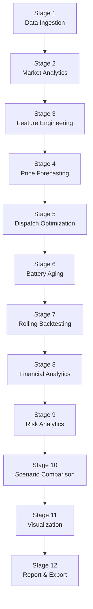
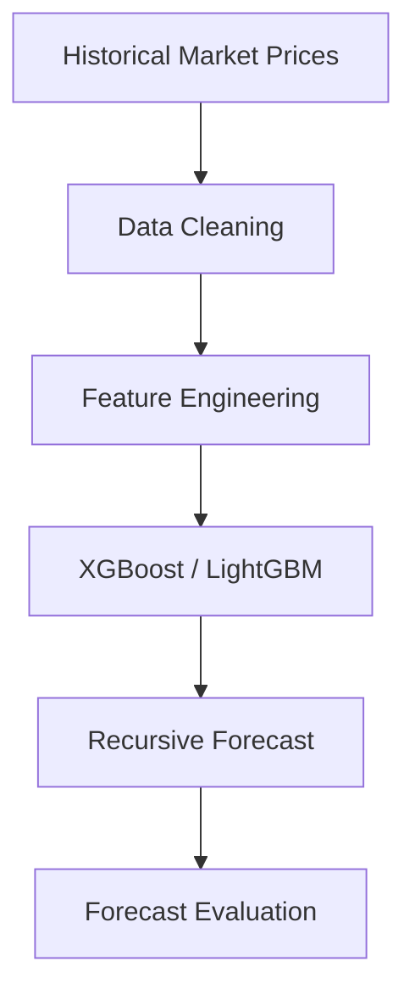
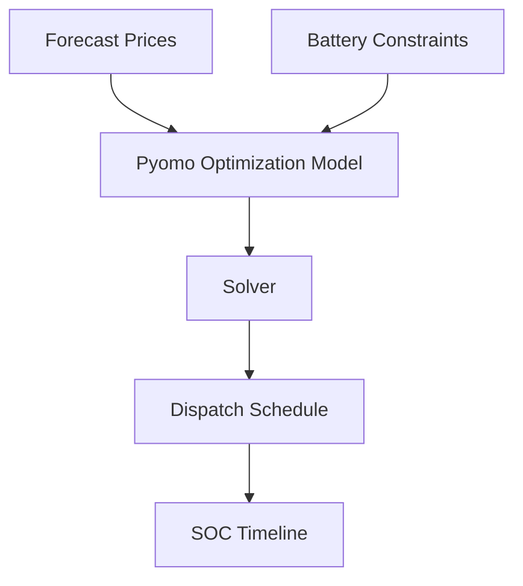
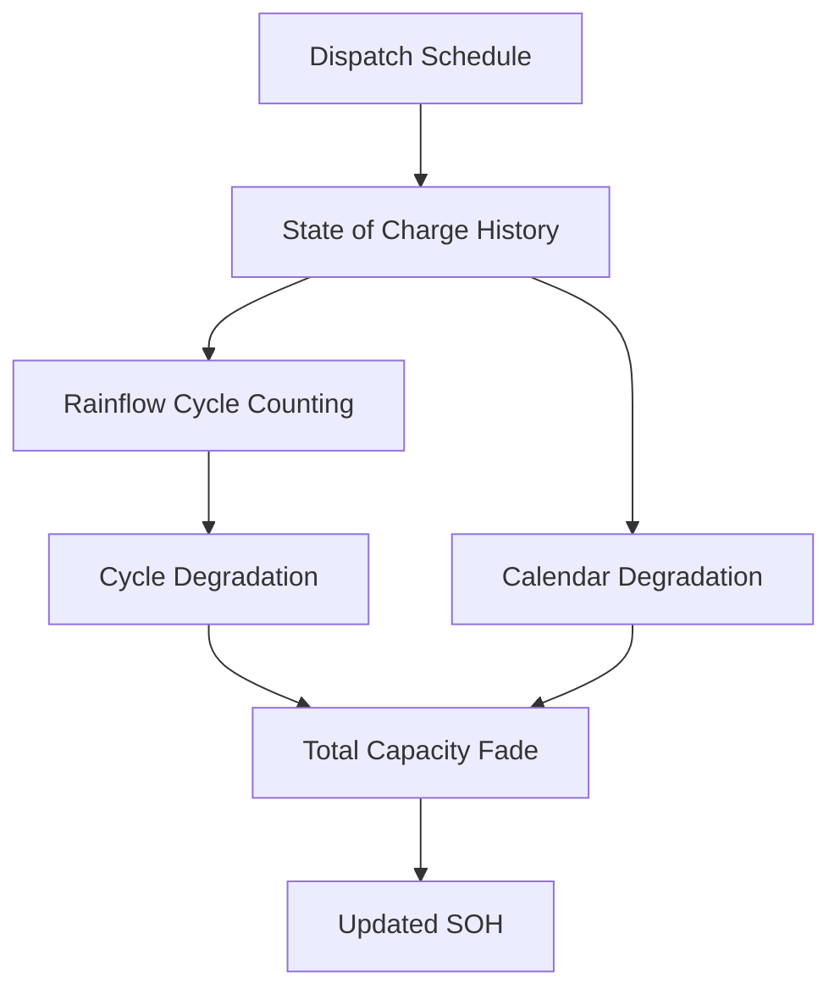
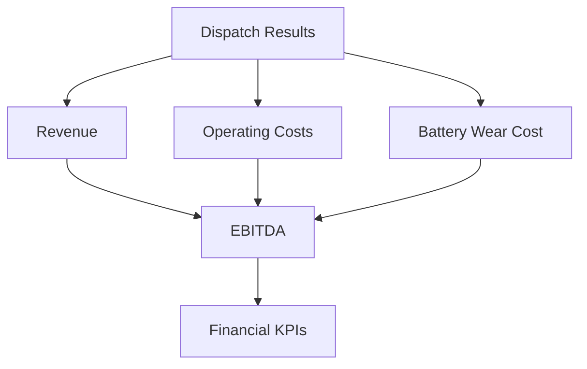
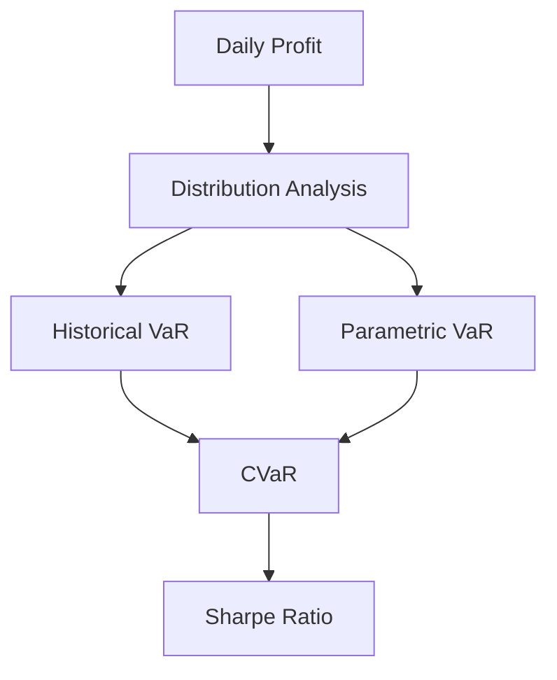
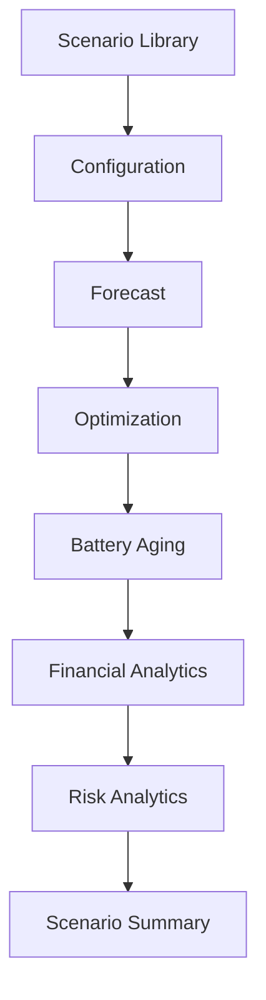

# ⚡ Utility-Scale Battery Energy Storage System (BESS) Arbitrage & Electrochemical Degradation Analytics Platform

<div align="center">

### AI-Powered Electricity Price Forecasting • Battery Dispatch Optimization • Battery Aging Analytics • Rolling Horizon Backtesting • Interactive Dashboard

<p align="center">
  
  
  
  
  
  
  
</p>

<div align="center">

**🌐 Live Dashboard**

**Streamlit Cloud:** [utility-scale-bess-arbitrage.streamlit.app](https://utility-scale-bess-arbitrage.streamlit.app/)

</div>
</div>

---

## Overview

This project is a complete analytics and optimization platform for **utility-scale Battery Energy Storage Systems (BESS)** participating in wholesale electricity markets.

The platform combines machine learning, mathematical optimization, battery degradation modelling, financial analytics, and interactive visualization into a single workflow that evaluates battery trading strategies under realistic operating conditions.

Instead of assuming perfect future electricity prices, the platform forecasts prices over multiple time horizons and continuously re-optimizes battery charging and discharging decisions while accounting for battery health degradation, operating costs, and market uncertainty.

It is designed as an end-to-end workflow that covers the complete lifecycle of a battery arbitrage simulation:

- Electricity market data processing
- Feature engineering
- Multi-step price forecasting
- Rolling horizon dispatch optimization
- Battery degradation estimation
- Closed-loop chronological backtesting
- Financial performance evaluation
- Risk analytics
- Multi-scenario comparison
- Interactive dashboard visualization

---

# Table of Contents

- [Overview](#overview)
- [Project Highlights](#project-highlights)
- [Problem Statement](#problem-statement)
- [Solution Overview](#solution-overview)
- [Key Features](#key-features)
- [Platform Architecture](#platform-architecture)
- [Core Modules](#core-modules)
- [Project Workflow](#project-workflow)
- [Dashboard Overview](#dashboard-overview)

> Installation, experiments, results, mathematical models, testing, roadmap, and contributing are included in Parts 2–4.

---

# Project Highlights

| Feature | Description |
|---------|-------------|
| **Electricity Price Forecasting** | Multi-step recursive forecasting using XGBoost and LightGBM across multiple forecast horizons. |
| **Rolling Horizon Optimization** | Battery dispatch optimization using Pyomo linear programming and mixed-integer programming. |
| **Battery Aging Analytics** | Cycle degradation using ASTM Rainflow Counting and calendar degradation using Arrhenius kinetics. |
| **Chronological Backtesting** | Closed-loop simulation that updates battery health after every execution window. |
| **Financial Analytics** | Revenue, EBITDA, degradation cost, throughput cost, ROI metrics, and operating margins. |
| **Risk Analytics** | Daily P&L distribution, Value-at-Risk (VaR), Conditional Value-at-Risk (CVaR), and Sharpe Ratio. |
| **Scenario Engine** | 28 configurable operating scenarios across chemistry, efficiency, sizing, temperature, forecasting, and degradation assumptions. |
| **Interactive Dashboard** | Multipage Streamlit dashboard with interactive analytics, KPIs, charts, and experiment explorer. |
| **Publication Graphics** | Automatic generation of high-resolution figures and downloadable outputs. |
| **Export Pipeline** | CSV, Excel, JSON, PNG, PDF, and experiment summaries. |

---

# Problem Statement

Battery Energy Storage Systems generate revenue by buying electricity when prices are low and selling electricity when prices are high.

In real-world electricity markets, this decision is complicated by several operational challenges:

- Future electricity prices are uncertain.
- Forecast errors increase as prediction horizons become longer.
- Charging and discharging accelerate battery degradation.
- Battery degradation has an economic cost.
- Battery health changes future operating capability.
- Market volatility affects financial risk and profitability.

Most simplified arbitrage models ignore one or more of these constraints by assuming:

- Perfect knowledge of future prices.
- Infinite battery lifetime.
- Constant battery capacity.
- Fixed degradation cost.
- Static optimization without feedback from battery aging.

This platform models these operational factors together within one continuous simulation workflow.

---

## Solution Overview

The platform solves the complete battery arbitrage workflow through four interconnected systems.

## 1. Forecast Electricity Prices

Machine learning models predict future wholesale electricity prices across configurable forecasting horizons.

**Supported forecasting horizons**

- 12 Hours
- 24 Hours
- 36 Hours
- 48 Hours
- 72 Hours

The forecasting module supports recursive prediction where previous predicted values become inputs for future predictions.

---

## 2. Optimize Battery Dispatch

Using forecasted prices, the optimizer determines:

- When to charge.
- When to discharge.
- How much energy to store.
- State of Charge trajectory.
- Power limits.
- Round-trip efficiency losses.
- End-of-horizon battery constraints.

The optimization is solved using Pyomo with configurable linear or mixed-integer formulations.

---

## 3. Update Battery Health

Every dispatch schedule produces physical battery wear.

Battery degradation is estimated using:

- Rainflow cycle counting for cycling degradation.
- Arrhenius temperature model for calendar degradation.
- Equivalent Full Cycles (EFC).
- State of Health (SOH).
- Economic degradation cost.

The updated SOH becomes an input for the next optimization cycle.

---

## 4. Evaluate Financial Performance

The simulation produces operational and financial metrics including:

- Gross Arbitrage Revenue
- Battery Wear Cost
- Fixed O&M
- Variable O&M
- Net Operating Profit
- EBITDA Margin
- Value Capture Ratio
- Forecast Error Metrics
- Risk Metrics

---

## Key Features

## Electricity Market Analytics

- Historical wholesale electricity price analysis.
- Hourly, daily, weekly, and seasonal market trends.
- Price volatility diagnostics.
- Negative price detection.
- Peak/off-peak spread analysis.
- Price distribution statistics.

---

## Machine Learning Forecasting

- Recursive multi-step forecasting.
- XGBoost forecasting pipeline.
- LightGBM forecasting pipeline.
- Forecast horizon comparison.
- Forecast error diagnostics.
- MAE, RMSE, and Directional Accuracy metrics.

---

## Battery Dispatch Optimization

- Rolling horizon optimization.
- Configurable look-ahead window.
- Configurable execution window.
- SOC constraints.
- SOE dynamics.
- Charging/discharging efficiency.
- Non-simultaneous charging and discharging.
- Wear penalty optimization.

---

## Battery Aging Engine

- ASTM E1049 Rainflow Counting.
- Cycle depth extraction.
- Cycle histogram generation.
- Arrhenius calendar degradation.
- Temperature sensitivity analysis.
- State of Health tracking.
- Equivalent Full Cycles calculation.

---

## Financial Analytics

- Revenue waterfall.
- EBITDA calculation.
- Unit economics.
- Operating margin.
- Throughput cost.
- Replacement cost estimation.
- Annual degradation cost.
- Asset utilization metrics.

---

## Risk Analytics

- Daily profit distribution.
- Historical VaR.
- Parametric VaR.
- Conditional VaR.
- Maximum Drawdown.
- Rolling Sharpe Ratio.
- Profit stability metrics.

---

## Multi-Scenario Simulation

Evaluate the battery under different operating assumptions including:

- Battery chemistry.
- Forecast horizon.
- Battery temperature.
- Wear penalty.
- Battery sizing.
- Round-trip efficiency.
- Forecasting model.
- Degradation assumptions.

---

## Interactive Dashboard

Interactive dashboard pages include:

1. Executive Overview
2. Market Explorer
3. Feature Engineering
4. Price Forecasting
5. Dispatch Optimization
6. Battery Aging
7. Rolling Backtesting
8. Financial Analytics
9. Risk Analytics
10. Scenario Comparison
11. Publication Figures
12. Experiment Runner

---

## Platform Architecture

The platform follows a modular pipeline where each stage feeds the next stage through structured outputs.

## High-Level Architecture


### Architecture Summary

| Layer | Purpose |
|-------|----------|
| **Data Layer** | Reads, validates, cleans, and prepares electricity market data. |
| **Forecast Layer** | Generates multi-step electricity price forecasts using machine learning models. |
| **Optimization Layer** | Produces optimal charging/discharging schedules under operational constraints. |
| **Battery Layer** | Calculates battery degradation, SOH, and Equivalent Full Cycles. |
| **Analytics Layer** | Computes revenue, degradation cost, profitability, and risk metrics. |
| **Visualization Layer** | Displays KPIs, charts, comparisons, and downloadable experiment results. |

---

# Core Modules

The repository is organized into independent analytical modules that communicate through structured outputs.

| Module | Responsibility |
|--------|----------------|
| **forecasting/** | Electricity price forecasting models and prediction pipeline. |
| **optimization/** | Pyomo dispatch optimization models. |
| **battery/** | Battery degradation models, chemistry specifications, SOH tracking, and cycle counting. |
| **backtesting/** | Chronological rolling simulation engine. |
| **analytics/** | Financial KPIs, risk metrics, and operating economics. |
| **visualization/** | Charts, publication figures, dashboards, and exports. |
| **experiments/** | Scenario definitions and experiment execution engine. |
| **pages/** | Streamlit dashboard pages. |
| **streamlit_utils/** | Shared dashboard utilities and reusable components. |
| **results/** | Generated KPIs, figures, reports, and experiment outputs. |

---

## Project Workflow

The complete simulation pipeline consists of **12 sequential stages**.



---

## Stage-by-Stage Workflow

### Stage 1 — Data Ingestion

Input electricity market datasets are validated and standardized before simulation.

Tasks include:

- Timestamp parsing.
- Missing value handling.
- Duplicate removal.
- Hourly alignment.
- Time-series consistency checks.

**Output**

Clean hourly electricity price dataset.

---

### Stage 2 — Market Analytics

Exploratory analytics identify important market characteristics.

Includes:

- Distribution analysis.
- Daily and weekly trends.
- Hourly heatmaps.
- Volatility analysis.
- Seasonal patterns.
- Peak spread analysis.

**Output**

Market diagnostic statistics and visualizations.

---

### Stage 3 — Feature Engineering

Transforms raw electricity prices into forecasting features.

Generated features include:

- Lag variables.
- Rolling averages.
- Rolling minimum/maximum.
- Rolling standard deviation.
- Calendar features.
- Fourier cyclic features.

**Output**

Machine-learning-ready feature matrix.

---

### Stage 4 — Price Forecasting

Generates recursive electricity price forecasts.

Models supported:

- XGBoost
- LightGBM

Forecast diagnostics include:

- MAE
- RMSE
- MAPE
- Directional Accuracy

**Output**

Forecasted price trajectory.

---

### Stage 5 — Dispatch Optimization

Forecasted prices become optimization inputs.

The optimizer determines:

- Charging schedule.
- Discharging schedule.
- State of Energy.
- State of Charge.
- Energy throughput.

**Output**

Optimal dispatch schedule.

---

### Stage 6 — Battery Aging

Dispatch schedules are converted into battery stress events.

Calculates:

- Cycle degradation.
- Calendar degradation.
- SOH.
- EFC.
- Wear cost.

**Output**

Updated battery health state.

---

### Stage 7 — Rolling Backtesting

Runs chronological simulation across the complete operating horizon.

Each execution window performs:

1. Forecast.
2. Optimize.
3. Execute.
4. Update battery health.
5. Repeat.

**Output**

Chronological operational history.

---

### Stage 8 — Financial Analytics

Calculates operational economics.

Outputs include:

- Revenue.
- EBITDA.
- Cost breakdown.
- Battery wear cost.
- Throughput economics.

---

### Stage 9 — Risk Analytics

Evaluates downside financial risk.

Metrics include:

- Daily P&L.
- Historical VaR.
- Parametric VaR.
- CVaR.
- Rolling Sharpe Ratio.

---

### Stage 10 — Scenario Comparison

Runs predefined experimental scenarios.

Compares:

- Profitability.
- Battery health.
- Forecast quality.
- Risk.
- Operating efficiency.

---

### Stage 11 — Visualization

Generates publication-quality figures and dashboard visualizations.

Outputs include:

- PNG
- PDF
- Plotly charts
- Interactive dashboard figures

---

### Stage 12 — Report & Export

Exports complete experiment outputs.

Supported formats:

- CSV
- Excel
- JSON
- PNG
- PDF
- Markdown summaries

---

# Dashboard Overview

The project includes a multi-page interactive Streamlit application that allows users to explore forecasts, optimization results, degradation analytics, financial metrics, and experiment comparisons from a single interface.

## Dashboard Pages

| Page | Description |
|------|-------------|
| **Executive Overview** | Overall KPIs, revenue summary, battery health, and operating statistics. |
| **Market Explorer** | Electricity price trends, volatility, seasonal behavior, and spread analysis. |
| **Feature Engineering** | Lag features, rolling statistics, cyclical features, and feature importance. |
| **Price Forecasting** | Forecast vs actual prices, error metrics, and horizon comparison. |
| **Dispatch Optimization** | Charging/discharging schedules, SOC trajectory, SOE trajectory, and dispatch timeline. |
| **Battery Aging** | Rainflow cycle histogram, SOH evolution, degradation breakdown, and EFC analysis. |
| **Rolling Backtesting** | Chronological simulation timeline and cumulative profit tracking. |
| **Financial Analytics** | Revenue waterfall, EBITDA, operating costs, throughput cost, and profitability metrics. |
| **Risk Analytics** | Daily profit distribution, VaR, CVaR, Sharpe Ratio, and drawdown analysis. |
| **Scenario Comparison** | Compare all predefined operating scenarios with interactive filters. |
| **Publication Figures** | Browse and export generated figures in high resolution. |
| **Experiment Runner** | Execute scenario sweeps and generate downloadable outputs. |

---

## Dashboard Capabilities

The Streamlit dashboard provides:

- Interactive KPIs.
- Dynamic filtering.
- Scenario comparison.
- Downloadable reports.
- Interactive Plotly visualizations.
- Experiment explorer.
- Battery health explorer.
- Forecast diagnostics.
- Risk analytics explorer.
- Financial waterfall visualization.

---

## Dashboard Outputs

The dashboard automatically loads generated outputs from the simulation pipeline and presents them as interactive analytics.

| Category | Outputs |
|----------|---------|
| Forecasting | Predictions, forecast errors, horizon comparison. |
| Optimization | Dispatch schedule, SOC trajectory, SOE trajectory. |
| Battery Health | SOH history, EFC, degradation breakdown. |
| Finance | Revenue, EBITDA, degradation cost, operating costs. |
| Risk | VaR, CVaR, Sharpe Ratio, drawdown. |
| Experiments | Scenario comparison tables, Pareto visualization, sensitivity analysis. |

---

---

# Baseline Results

The platform evaluates battery performance over a complete operating horizon using configurable forecasting, optimization, degradation, and financial parameters.

The reference configuration uses:

| Parameter | Value |
|-----------|-------|
| Battery Capacity | **100 MWh** |
| Power Rating | **50 MW** |
| Battery Chemistry | **NMC** |
| Forecast Horizon | **48 Hours** |
| Execution Step | **24 Hours** |
| Operating Temperature | **25°C** |
| Wear Penalty | **$10/MWh** |
| Simulation Duration | **8,400 Hours (350 Days)** |

---

## Performance Summary

| Metric | Value |
|--------|-------|
| Gross Arbitrage Revenue | **$4,982,570** |
| Battery Wear Cost | **$253,757** |
| Fixed O&M Cost | **$359,589** |
| Variable O&M Cost | **$19,018** |
| Net Operating Profit | **$4,350,206** |
| EBITDA Margin | **87.31%** |
| Final Battery State of Health | **98.20%** |
| Capacity Fade | **1.80%** |
| Equivalent Full Cycles | **190.18 EFC** |
| Forecast MAE | **$2.04/MWh** |
| Value Capture Ratio | **85.5%** |
| Annualized Sharpe Ratio | **3.65** |
| Daily 95% Value-at-Risk | **-$1,482/day** |
| Daily 95% Conditional VaR | **-$2,104/day** |

---

## Key Performance Indicators

### Battery Performance

| KPI | Description |
|-----|-------------|
| State of Charge (SOC) | Battery operating charge level throughout the simulation. |
| State of Energy (SOE) | Available stored energy after charging/discharging losses. |
| State of Health (SOH) | Remaining usable battery capacity over time. |
| Equivalent Full Cycles (EFC) | Lifetime throughput normalized into full battery cycles. |
| Battery Wear Cost | Estimated degradation cost accumulated through operation. |

---

### Forecast Performance

| KPI | Description |
|-----|-------------|
| Mean Absolute Error (MAE) | Average forecasting error. |
| Root Mean Square Error (RMSE) | Penalizes larger forecasting errors. |
| Directional Accuracy | Percentage of correctly predicted price movements. |
| Forecast Horizon Comparison | Performance across multiple prediction windows. |
| Value Capture Ratio | Realized arbitrage value relative to perfect foresight. |

---

### Financial Performance

| KPI | Description |
|-----|-------------|
| Gross Arbitrage Revenue | Revenue generated before operating costs. |
| Fixed O&M | Annual operating expenditure independent of throughput. |
| Variable O&M | Throughput-dependent operating cost. |
| Battery Wear Cost | Cost attributed to degradation. |
| Net Operating Profit | Profit after all operating costs. |
| EBITDA Margin | Operating profitability percentage. |
| Revenue per Installed MW | Revenue normalized by installed power capacity. |
| Revenue per Cycled MWh | Revenue normalized by battery throughput. |

---

### Risk Performance

| KPI | Description |
|-----|-------------|
| Historical VaR | Historical downside daily loss estimate. |
| Parametric VaR | Statistical downside loss estimate. |
| Conditional VaR | Expected loss beyond VaR threshold. |
| Maximum Drawdown | Largest cumulative loss from peak. |
| Rolling Sharpe Ratio | Risk-adjusted profitability through time. |

---

## Scenario Library

The platform includes **28 predefined operating scenarios** for sensitivity analysis and operational benchmarking.

Scenarios are grouped into seven categories.

---

## Scenario Categories Overview

| Category | Number of Scenarios |
|-----------|--------------------|
| Battery Chemistry | 3 |
| Forecast Horizon | 5 |
| Operating Temperature | 4 |
| Wear Penalty | 5 |
| Battery Size | 3 |
| Round Trip Efficiency | 3 |
| Forecasting & Degradation Models | 5 |
| **Total** | **28** |

---

## Battery Chemistry Scenarios

Compare different battery technologies under identical market conditions.

| Scenario | Description |
|----------|-------------|
| `chem_nmc_baseline` | Standard NMC battery configuration. |
| `chem_lfp_stationary` | LFP battery optimized for stationary storage applications. |
| `chem_lto_high_cycle` | High-cycle-life LTO battery configuration. |

**Comparison Objectives**

- Cycle life
- Revenue
- SOH preservation
- Throughput capability
- Wear cost

---

## Forecast Horizon Scenarios

Evaluate the effect of forecast horizon length on dispatch quality.

| Scenario | Forecast Window |
|----------|----------------|
| `horizon_12h` | 12 Hours |
| `horizon_24h` | 24 Hours |
| `horizon_36h` | 36 Hours |
| `horizon_48h` | 48 Hours |
| `horizon_72h` | 72 Hours |

**Evaluation Metrics**

- Forecast error
- Revenue
- Value Capture Ratio
- Dispatch quality
- Computational cost

---

## Thermal Scenarios

Evaluate degradation under different operating temperatures.

| Scenario | Temperature |
|----------|-------------|
| `thermal_mild_15c` | 15°C |
| `thermal_reference_25c` | 25°C |
| `thermal_elevated_35c` | 35°C |
| `thermal_extreme_45c` | 45°C |

Outputs include:

- Calendar degradation.
- Total degradation.
- SOH trajectory.
- Revenue impact.

---

## Wear Penalty Scenarios

Analyze the economic trade-off between revenue maximization and battery preservation.

| Scenario | Wear Penalty |
|----------|--------------|
| `deg_cost_zero` | $0/MWh |
| `deg_cost_low_5` | $5/MWh |
| `deg_cost_nominal_10` | $10/MWh |
| `deg_cost_high_20` | $20/MWh |
| `deg_cost_ultra_35` | $35/MWh |

---

## Battery Size Scenarios

Evaluate different battery power-to-energy ratios.

| Scenario | Configuration |
|----------|---------------|
| `size_25mw_100mwh` | 25 MW / 100 MWh |
| `size_50mw_100mwh` | 50 MW / 100 MWh |
| `size_100mw_100mwh` | 100 MW / 100 MWh |

Comparison metrics:

- Revenue.
- Battery utilization.
- Throughput.
- EFC.
- Degradation.

---

## Efficiency Scenarios

| Scenario | Round Trip Efficiency |
|----------|-----------------------|
| `eff_low_85` | 85% |
| `eff_base_90` | 90% |
| `eff_high_95` | 95% |

Outputs:

- Lost energy.
- Revenue difference.
- Battery cycling efficiency.

---

## Forecast Model Scenarios

| Scenario | Model |
|----------|-------|
| `fc_persistence` | Naive persistence baseline. |
| `fc_recursive_ml` | Recursive machine learning forecasting. |
| `fc_perfect_foresight` | Upper-bound benchmark using actual prices. |

Purpose:

- Compare achievable vs theoretical dispatch value.
- Measure Value Capture Ratio.

---

## Degradation Model Scenarios

| Scenario | Description |
|----------|-------------|
| `aging_none` | No degradation applied. |
| `aging_calendar_only` | Calendar aging only. |
| `aging_cycle_only` | Cycling degradation only. |
| `aging_combined` | Calendar + cycle degradation. |
| `aging_dynamic_feedback` | Closed-loop SOH feedback. |

---

## Scenario Outputs

Every experiment produces standardized outputs.

| Output | Format |
|--------|--------|
| KPI Summary | JSON |
| Financial Summary | CSV |
| SOH Timeline | CSV |
| Forecast Diagnostics | CSV |
| Dispatch Schedule | CSV |
| Interactive Charts | Plotly |
| Figures | PNG / PDF |
| Scenario Summary | Excel |

---

# Results Directory

Simulation outputs are automatically organized into structured folders.

```text
results/
│
├── dashboard/
│   ├── kpis.json
│   ├── revenue.json
│   ├── soh.json
│   └── experiments.json
│
├── experiments/
│   ├── scenario_matrix.csv
│   ├── comparison_results.csv
│   ├── pareto_frontier.csv
│   └── sensitivity_analysis.xlsx
│
├── forecasts/
│   ├── predictions.csv
│   ├── forecast_metrics.csv
│   └── horizon_comparison.csv
│
├── optimization/
│   ├── dispatch_schedule.csv
│   ├── soc_timeline.csv
│   └── soe_timeline.csv
│
├── degradation/
│   ├── rainflow_cycles.csv
│   ├── calendar_degradation.csv
│   ├── cycle_degradation.csv
│   └── soh_history.csv
│
├── figures/
│   ├── market_analysis/
│   ├── forecasting/
│   ├── optimization/
│   ├── degradation/
│   ├── finance/
│   └── risk/
│
└── reports/
    ├── summary_report.md
    ├── metrics_report.csv
    └── dashboard_export.xlsx
```

---

## Repository Structure

The repository is organized into modular components for forecasting, optimization, degradation analysis, financial evaluation, visualization, and experimentation.

```text
utility-scale-bess-arbitrage/
│
├── app.py                          # Streamlit Dashboard
├── main.py                         # Pipeline Runner
│
├── forecasting/
│   ├── features.py
│   ├── xgboost_model.py
│   ├── lightgbm_model.py
│   ├── recursive_forecast.py
│   └── evaluation.py
│
├── optimization/
│   ├── dispatch_model.py
│   ├── rolling_optimizer.py
│   ├── constraints.py
│   └── solver.py
│
├── battery/
│   ├── rainflow.py
│   ├── degradation.py
│   ├── arrhenius.py
│   ├── chemistry.py
│   └── soh_tracker.py
│
├── backtesting/
│   ├── simulator.py
│   ├── comparison.py
│   ├── dashboard_data.py
│   └── telemetry.py
│
├── analytics/
│   ├── finance.py
│   ├── risk.py
│   ├── waterfall.py
│   ├── kpis.py
│   └── metrics.py
│
├── visualization/
│   ├── figures.py
│   ├── plotly_charts.py
│   ├── reports.py
│   └── exports.py
│
├── experiments/
│   ├── scenarios.py
│   ├── runner.py
│   ├── registry.py
│   └── sensitivity.py
│
├── pages/
│   ├── 01_Home.py
│   ├── 02_Market_Explorer.py
│   ├── 03_Feature_Engineering.py
│   ├── 04_Price_Forecasting.py
│   ├── 05_Dispatch_Optimization.py
│   ├── 06_Battery_Aging.py
│   ├── 07_Rolling_Backtesting.py
│   ├── 08_Financial_Analytics.py
│   ├── 09_Risk_Analytics.py
│   ├── 10_Scenario_Comparison.py
│   ├── 11_Publication_Figures.py
│   └── 12_Experiment_Runner.py
│
├── streamlit_utils/
│   ├── charts.py
│   ├── downloads.py
│   ├── loaders.py
│   ├── session.py
│   └── theme.py
│
├── tests/
│   ├── forecasting/
│   ├── optimization/
│   ├── battery/
│   ├── analytics/
│   └── backtesting/
│
├── results/
│
├── requirements.txt
├── pyproject.toml
├── packages.txt
└── README.md
```

---

# Technology Stack

The platform is built entirely with Python and open-source scientific computing libraries.

## Core Libraries

| Category | Technologies |
|----------|--------------|
| Programming Language | Python 3.11+ |
| Optimization | Pyomo |
| Machine Learning | XGBoost, LightGBM, Scikit-learn |
| Data Processing | Pandas, NumPy |
| Visualization | Plotly, Matplotlib |
| Dashboard | Streamlit |
| Statistics | SciPy |
| Testing | PyTest |
| Solver | GLPK / HiGHS / CBC |

---

## Machine Learning

- Recursive forecasting
- Feature engineering
- Lag features
- Rolling statistics
- Cyclical encoding
- Error evaluation

---

## Optimization

- Linear Programming
- Mixed Integer Programming
- Rolling Horizon Dispatch
- SOC Constraints
- SOE Dynamics

---

## Battery Analytics

- Rainflow Counting
- Arrhenius Calendar Aging
- State of Health
- Equivalent Full Cycles
- Degradation Cost

---

## Financial Analytics

- Revenue Waterfall
- EBITDA
- Operating Costs
- Unit Economics
- Risk Metrics

---

## Installation Guide

The platform supports Windows, Linux, and macOS.

---

## Prerequisites

Before installing, ensure the following software is available.

| Requirement | Version |
|-------------|---------|
| Python | 3.11 or newer |
| Git | Latest stable version |
| Pip | Latest stable version |
| Virtual Environment | `venv` |
| Solver | GLPK (recommended) |

---

## Clone the Repository

```bash
git clone https://github.com/<your-github-username>/utility-scale-bess-arbitrage.git

cd utility-scale-bess-arbitrage
```

Replace `<your-github-username>` with your GitHub username.

---

## Environment Setup

## Windows

### Create Virtual Environment

```powershell
python -m venv .venv
```

### Activate Environment

```powershell
.venv\Scripts\Activate.ps1
```

### Upgrade Pip

```powershell
python -m pip install --upgrade pip
```

### Install Dependencies

```powershell
pip install -r requirements.txt
```

---

## Linux / macOS

### Create Environment

```bash
python3 -m venv .venv
```

### Activate Environment

```bash
source .venv/bin/activate
```

### Upgrade Pip

```bash
python -m pip install --upgrade pip
```

### Install Dependencies

```bash
pip install -r requirements.txt
```

---

## Solver Installation

Pyomo requires an optimization solver.

## Windows (GLPK)

Install GLPK using Winget.

```powershell
winget install GLPK.GLPK
```

Verify installation.

```powershell
glpsol --version
```

---

## Ubuntu / Debian

```bash
sudo apt update

sudo apt install -y glpk-utils libgl1-mesa-glx
```

---

## macOS

Using Homebrew:

```bash
brew install glpk
```

Verify installation.

```bash
glpsol --version
```

---

## Verify Installation

Run the following command after installation.

```bash
python main.py --fast
```

Expected behavior:

- Dependencies load successfully.
- Sample simulation executes.
- Output folders are generated inside `results/`.

---

## Quick Start

Run a complete simulation in four steps.

### Step 1 — Clone Repository

```bash
git clone https://github.com/MohdNematullah/utility-scale-bess-arbitrage.git
cd utility-scale-bess-arbitrage
```

### Step 2 — Create Environment

```bash
python -m venv .venv
```

### Step 3 — Install Packages

```bash
pip install -r requirements.txt
```

### Step 4 — Launch Dashboard

```bash
streamlit run app.py
```

Open your browser at:

```text
http://localhost:8501
```

---

## Running the Platform

The repository provides several execution modes depending on the desired workflow.

## Full Pipeline

Runs the complete workflow across the full simulation period.

```bash
python main.py --run
```

Pipeline stages include:

- Forecasting
- Optimization
- Battery aging
- Financial analytics
- Risk analytics
- Figure generation

---

## Fast Mode

Runs a shortened simulation useful for verifying installation.

```bash
python main.py --fast
```

---

## Forecasting Only

```bash
python main.py --forecast
```

Outputs:

- Forecast CSV.
- Error metrics.
- Prediction charts.

---

## Optimization Only

```bash
python main.py --optimize
```

Outputs:

- Dispatch schedule.
- SOC trajectory.
- SOE timeline.

---

## Battery Aging Only

```bash
python main.py --aging
```

Outputs:

- SOH timeline.
- EFC.
- Rainflow cycles.
- Calendar degradation.

---

## Financial Analytics Only

```bash
python main.py --finance
```

Outputs:

- Revenue summary.
- EBITDA.
- Cost waterfall.
- Unit economics.

---

## Risk Analytics Only

```bash
python main.py --risk
```

Outputs:

- VaR.
- CVaR.
- Sharpe Ratio.
- Drawdown.

---

## Generate Dashboard Data

```bash
python main.py --dashboard
```

Creates JSON files consumed by Streamlit.

---

## Run All Scenarios

Execute all predefined experiment scenarios.

```bash
python main.py --experiments
```

Outputs:

- Scenario matrix.
- Comparison metrics.
- Pareto frontier.
- Sensitivity workbook.

---

## Generate Figures

Generate all visualization assets.

```bash
python main.py --figures
```

Exports figures into:

```text
results/figures/
```

---

## Compare Scenarios

```bash
python main.py --compare \
    --registry-file results/experiments/scenario_matrix.csv \
    --output-dir results/comparison
```

Outputs:

- Comparison tables.
- Pareto frontier.
- Rankings.
- Tornado plots.

---

## Streamlit Dashboard

Launch the interactive dashboard locally.

```bash
streamlit run app.py
```

The dashboard automatically reads generated outputs from the `results/dashboard/` directory and provides interactive analytics across forecasting, optimization, battery health, finance, risk, and scenario comparison modules.

---

# Command Line Reference

| Command | Description |
|---------|-------------|
| `python main.py --run` | Complete simulation pipeline. |
| `python main.py --fast` | Short verification run. |
| `python main.py --forecast` | Forecast electricity prices only. |
| `python main.py --optimize` | Battery dispatch optimization only. |
| `python main.py --aging` | Battery degradation analysis only. |
| `python main.py --finance` | Financial KPI calculation only. |
| `python main.py --risk` | Risk analytics only. |
| `python main.py --dashboard` | Generate Streamlit dashboard data. |
| `python main.py --experiments` | Execute all predefined scenarios. |
| `python main.py --figures` | Generate figures and visualizations. |
| `python main.py --compare` | Compare experiment scenarios. |

---

## Output Summary

After a successful run, the pipeline generates:

| Output Type | Location |
|-------------|----------|
| Dashboard Data | `results/dashboard/` |
| Forecast Outputs | `results/forecasts/` |
| Dispatch Outputs | `results/optimization/` |
| Battery Health | `results/degradation/` |
| Financial Metrics | `results/reports/` |
| Experiment Results | `results/experiments/` |
| Figures | `results/figures/` |

---
---

## Configuration

The platform is designed to be configurable without modifying the core source code. Simulation settings, battery parameters, optimization horizons, forecasting models, and experiment scenarios can be changed from configuration files or command-line arguments.

## Default Simulation Configuration

| Parameter | Default Value |
|-----------|---------------|
| Simulation Hours | `8400` |
| Forecast Horizon | `48` hours |
| Execution Step | `24` hours |
| Battery Power | `50 MW` |
| Battery Energy | `100 MWh` |
| Round Trip Efficiency | `90%` |
| Minimum SOC | `10%` |
| Maximum SOC | `90%` |
| Initial SOC | `50%` |
| Target End SOC | `50%` |
| Battery Chemistry | `NMC` |
| Operating Temperature | `25°C` |
| Wear Penalty | `$10/MWh` |
| Solver | `GLPK` |

---

## Battery Configuration

Battery behavior is fully parameterized.

```yaml
battery:
  chemistry: NMC
  power_mw: 50
  energy_mwh: 100
  round_trip_efficiency: 0.90
  soc_min: 0.10
  soc_max: 0.90
  soc_initial: 0.50
  soc_target: 0.50
```

Supported chemistries:

- NMC
- LFP
- LTO

Each chemistry contains independent degradation parameters and operating assumptions.

---

## Forecast Configuration

```yaml
forecast:
  model: xgboost
  horizon_hours: 48
  recursive: true
  lag_hours:
    - 1
    - 2
    - 24
    - 48
    - 168
```

Supported models:

- XGBoost
- LightGBM
- Persistence Baseline

---

## Optimization Configuration

```yaml
optimization:
  horizon_hours: 48
  execution_step_hours: 24
  solver: glpk
  variable_om_cost: 0.5
  degradation_cost: 10
```

---

## Temperature Configuration

```yaml
temperature:
  operating_temperature_c: 25
  calendar_ageing: true
```

Temperature scenarios:

- 15°C
- 25°C
- 35°C
- 45°C

---

## Experiment Configuration

Example experiment definition:

```yaml
scenario:
  name: horizon_48h
  chemistry: NMC
  forecast_model: XGBoost
  temperature: 25
  wear_penalty: 10
  horizon: 48
```

---

## Mathematical Framework

The platform combines electricity price forecasting, rolling-horizon optimization, battery degradation modelling, and financial risk analytics into a unified Battery Energy Storage System (BESS) arbitrage workflow.

## 1. Rolling-Horizon Dispatch Optimization

At each rolling decision step, the optimizer maximizes the **net operating profit** over the forecast horizon while considering electricity prices, battery degradation cost, and variable operating costs.

### Objective Function

$$\max \sum_{t=1}^{H} \left[ \hat{\lambda}_t (P_t^{dis} - P_t^{chg}) - c_{deg} P_t^{dis} - c_{vOM}(P_t^{chg} + P_t^{dis}) \right]\Delta t$$

### Variable Definitions

| **Symbol** | **Description** | **Unit** |
| --- | --- | --- |
| $\hat{\lambda}_t$\vert{} Forecast electricity price at time *t* \vert{}$/MWh |  |  |
| $P_t^{chg}$ | Battery charging power | MW |
| $P_t^{dis}$ | Battery discharging power | MW |
| $c_{deg}$\vert{} Battery degradation cost (wear penalty) \vert{}$/MWh |  |  |
| $c_{vOM}$\vert{} Variable operation and maintenance cost \vert{}$/MWh |  |  |
| $\Delta t$ | Dispatch time interval | Hour |
| $H$ | Optimization horizon | Hours |

---

## 2. Battery Energy Dynamics

The battery **State of Energy (SOE)** evolves over time based on charging and discharging power while accounting for one-way charging and discharging efficiencies.

### State of Energy (SOE)

$$E_t = E_{t-1} + \left( \eta_{chg} P_t^{chg} - \frac{P_t^{dis}}{\eta_{dis}} \right)\Delta t$$

### State of Charge (SOC)

$$SOC_t = \frac{E_t}{E_{nom} \times SOH_t}$$

### Operating Constraints

$$SOC_{min} \le SOC_t \le SOC_{max}$$

Where:

| **Symbol** | **Description** |
| --- | --- |
| $E_t$ | Battery energy at time *t* |
| $E_{nom}$ | Nominal battery energy capacity |
| $SOC_t$ | Battery State of Charge |
| $SOH_t$ | Battery State of Health |
| $\eta_{chg}$ | Charging efficiency |
| $\eta_{dis}$ | Discharging efficiency |
| $SOC_{min}$ | Minimum allowable SOC |
| $SOC_{max}$ | Maximum allowable SOC |

## 3. Battery State of Health (SOH)

Battery health decreases due to cycling and calendar aging.

$$
SOH = 1-(D_{cycle}+D_{calendar})
$$

Where:

- $D_{cycle}$ = cycle degradation.
- $D_{calendar}$ = calendar degradation.

---

## 4. Cycle Degradation using Rainflow Counting

Cycle degradation is estimated using ASTM E1049-85 Rainflow Counting and Miner's Rule.

$$
D_{cycle}
=
\sum_{i=1}^{N}
\frac{n_i}{N_f(DoD_i)}
$$

Where:

- $DoD_i$ = depth of discharge of cycle $i$.
- $N_f$ = allowable cycles before failure.
- $n_i$ = cycle count contribution.

---

## 5. Calendar Degradation using Arrhenius Model

Calendar aging depends on temperature and average battery State of Charge.

$$
D_{calendar}
=
k
\exp
\left(
-\frac{E_a}{RT}
\right)
\exp(k_{soc}\overline{SOC})
t^z
$$

Where:

- $E_a$ = activation energy.
- $R$ = universal gas constant.
- $T$ = cell temperature (Kelvin).
- $\overline{SOC}$ = average State of Charge.

---

## 6. Equivalent Full Cycles (EFC)

Battery utilization is measured using Equivalent Full Cycles.

$$
EFC
=
\frac
{\sum(P_t^{chg}\eta_{chg}+P_t^{dis})\Delta t}
{2E_{nom}}
$$

EFC provides a normalized measure of battery throughput independent of operating strategy.

---

## 7. Forecast Accuracy Metrics

The forecasting module evaluates prediction quality using Mean Absolute Error (MAE) and Root Mean Square Error (RMSE).

### Mean Absolute Error

$$
MAE=
\frac1N
\sum_{i=1}^{N}
|\hat{\lambda_i}-\lambda_i|
$$

### Root Mean Square Error

$$
RMSE=
\sqrt{
\frac1N
\sum_{i=1}^{N}
(\hat{\lambda_i}-\lambda_i)^2
}
$$

### Directional Accuracy

$$
DA=
\frac{\text{Correct Direction Predictions}}
{\text{Total Predictions}}
\times100
$$

---

## 8. Value Capture Ratio (VCR)

Value Capture Ratio compares the realized arbitrage profit against the theoretical perfect-foresight benchmark.

$$
VCR=
\frac{\Pi_{forecast}}
{\Pi_{perfect}}
\times100
$$

A higher Value Capture Ratio indicates that the forecasting and optimization pipeline captures a larger share of the theoretical arbitrage opportunity.

## Optimization Objective

For every rolling optimization window, the optimizer maximizes operating profit over the forecast horizon.

### Objective Components

The optimization considers:

- Electricity revenue from discharging.
- Electricity purchase cost while charging.
- Variable operating costs.
- Battery degradation cost.

The resulting dispatch schedule determines charging and discharging power for every time interval.

---

## Battery State Dynamics

The optimizer tracks battery energy continuously throughout the simulation.

### State Variables

| Variable | Description |
|----------|-------------|
| SOC | State of Charge |
| SOE | State of Energy |
| SOH | State of Health |
| EFC | Equivalent Full Cycles |

SOC remains within minimum and maximum operating limits during optimization.

---

## Operational Constraints

The optimizer enforces:

### Charging Constraints

- Charging power cannot exceed inverter capacity.
- Charging respects efficiency losses.

### Discharging Constraints

- Discharging power cannot exceed inverter capacity.
- Energy availability limits discharge.

### Battery Constraints

- Minimum SOC.
- Maximum SOC.
- Target terminal SOC.
- Round-trip efficiency.

### Dispatch Constraints

- No simultaneous charging and discharging.
- Rolling execution windows.
- Horizon boundary conditions.

---

## Rolling Horizon Strategy

The optimizer follows a rolling decision process instead of optimizing the entire year at once.


### Benefits

- Uses updated forecasts.
- Accounts for battery aging.
- Mimics operational decision making.
- Prevents end-of-horizon depletion.

---

## Forecasting Pipeline

The forecasting module predicts future wholesale electricity prices before optimization.

---

## Forecast Workflow



---

## Feature Engineering

The forecasting model generates multiple feature categories.

### Lag Features

- Previous hour.
- Previous two hours.
- Previous day.
- Previous two days.
- Previous week.

### Rolling Features

Rolling statistics over configurable windows.

Generated statistics include:

- Mean
- Standard deviation
- Minimum
- Maximum

### Calendar Features

Calendar-aware variables improve seasonality learning.

Features include:

- Hour of day.
- Day of week.
- Month.
- Weekend indicator.

### Cyclical Features

Calendar values are encoded using sine/cosine transformations.

Examples:

- Daily cycle.
- Weekly cycle.
- Annual cycle.

---

## Forecast Models

### XGBoost

Primary forecasting model.

Capabilities:

- Nonlinear regression.
- Recursive forecasting.
- Feature importance.
- Missing value handling.

---

### LightGBM

Alternative forecasting model.

Capabilities:

- Fast training.
- Efficient tree boosting.
- Horizon comparison.

---

### Persistence Baseline

Simple benchmark model.

Prediction:

- Future price equals previous observed price.

Used for comparison against machine learning forecasts.

---

## Forecast Evaluation Metrics

The platform evaluates every forecast using multiple metrics.

| Metric | Purpose |
|--------|---------|
| MAE | Average forecasting error. |
| RMSE | Penalizes larger errors. |
| MAPE | Percentage forecasting error. |
| Directional Accuracy | Correct price movement prediction. |
| Horizon Comparison | Compare forecast windows. |

---

## Forecast Outputs

Generated outputs include:

```text
results/forecasts/

├── predictions.csv
├── forecast_metrics.csv
├── horizon_comparison.csv
├── residuals.csv
└── feature_importance.csv
```

---

## Optimization Pipeline

The optimization module converts forecasted prices into battery dispatch schedules.

---

## Dispatch Workflow



---

## Inputs

The optimizer receives:

| Input | Source |
|-------|--------|
| Forecast Prices | Forecast Module |
| Battery Parameters | Configuration |
| SOC Initial State | Previous Simulation Step |
| SOH | Battery Aging Module |
| Wear Penalty | Scenario Configuration |

---

## Outputs

The optimizer produces:

| Output | Description |
|--------|-------------|
| Charging Schedule | Battery charging power. |
| Discharging Schedule | Battery discharging power. |
| SOC Timeline | Battery charge trajectory. |
| SOE Timeline | Battery energy trajectory. |
| Throughput | Energy cycled through battery. |

---

## Solver Support

Supported optimization solvers.

| Solver | Supported |
|--------|-----------|
| GLPK | ✅ |
| HiGHS | ✅ |
| CBC | ✅ |

GLPK is used as the default solver.

---

## Dispatch Timeline

Each optimization window produces hourly battery actions.

```text
Hour     Price     Action

01       Low       Charge

02       Low       Charge

03       Medium    Idle

04       High      Discharge

05       Peak      Discharge
```

---

# Battery Aging Engine

Battery degradation is modeled continuously throughout simulation.

---

## Battery Health Workflow



---

## State of Health (SOH)

SOH represents remaining usable battery capacity.

The simulation updates SOH after every execution window.

Outputs include:

- SOH timeline.
- Remaining capacity.
- Capacity fade percentage.

---

## Cycle Degradation

Cycle degradation depends on charging/discharging behavior.

### Rainflow Counting

The platform extracts charge-discharge cycles from SOC history using ASTM Rainflow Counting.

Outputs include:

- Cycle depth.
- Cycle count.
- Cycle histogram.
- Stress distribution.

---

## Equivalent Full Cycles

EFC converts partial cycles into normalized full battery cycles.

Example outputs:

| Metric | Description |
|--------|-------------|
| Daily EFC | Average cycles per day. |
| Total EFC | Cumulative battery throughput. |
| Remaining Cycle Budget | Estimated remaining useful life. |

---

## Calendar Degradation

Calendar aging occurs even when the battery is idle.

Inputs include:

- Operating temperature.
- Average SOC.
- Time duration.

Outputs include:

- Calendar degradation percentage.
- Temperature sensitivity.

---

## Combined Degradation

The platform combines:

- Cycle degradation.
- Calendar degradation.

Outputs:

| Output | Description |
|--------|-------------|
| Cycle Fade | Capacity loss from cycling. |
| Calendar Fade | Capacity loss from storage time. |
| Total Fade | Combined degradation. |
| Wear Cost | Economic value of degradation. |

---

## Battery Outputs

Generated files:

```text
results/degradation/

├── soh_history.csv
├── rainflow_cycles.csv
├── cycle_degradation.csv
├── calendar_degradation.csv
├── efc_history.csv
└── degradation_summary.csv
```

---

## Closed-Loop Backtesting

Backtesting evaluates battery performance chronologically over the complete simulation period.

---

## Backtesting Workflow


---

## Backtesting Outputs

| Output | Description |
|--------|-------------|
| Hourly Dispatch | Executed battery schedule. |
| SOC Timeline | Battery charge level. |
| Revenue Timeline | Revenue accumulation. |
| SOH Timeline | Battery health evolution. |
| Rolling KPIs | Financial metrics through time. |

---

## Financial Analytics Pipeline

Financial analytics convert operational outputs into business metrics.

---

## Financial Workflow



---

## Revenue Components

Revenue calculation includes:

- Arbitrage revenue.
- Charging cost.
- Discharging revenue.
- Operating expenses.
- Battery degradation cost.

---

## Operating Cost Components

| Cost | Description |
|------|-------------|
| Fixed O&M | Annual operating expenditure. |
| Variable O&M | Throughput-dependent cost. |
| Wear Cost | Battery degradation cost. |

---

## Financial Outputs

Generated outputs:

```text
results/reports/

├── revenue_summary.csv
├── ebitda_report.csv
├── waterfall.csv
├── operating_costs.csv
└── unit_economics.csv
```

---

## Risk Analytics Pipeline

Risk metrics evaluate downside financial exposure.

---

## Risk Workflow



---

## Risk Metrics

| Metric | Description |
|--------|-------------|
| Historical VaR | Historical downside loss estimate. |
| Parametric VaR | Statistical downside estimate. |
| Conditional VaR | Expected loss beyond VaR. |
| Maximum Drawdown | Largest cumulative decline. |
| Rolling Sharpe Ratio | Risk-adjusted profitability. |

---

## Risk Outputs

```text
results/risk/

├── daily_profit.csv
├── var_history.csv
├── cvar_history.csv
├── sharpe_history.csv
└── drawdown_history.csv
```

---

## Experiment Pipeline

The experiment engine automates scenario execution.

---

## Experiment Workflow



---

## Batch Experiment Runner

Execute multiple scenarios automatically.

Example:

```bash
python main.py --experiments
```

The runner executes every scenario sequentially and exports standardized results.

---

## Scenario Comparison Outputs

Generated outputs:

```text
results/experiments/

├── scenario_matrix.csv
├── comparison_results.csv
├── pareto_frontier.csv
├── sensitivity_analysis.xlsx
└── experiment_summary.json
```

---

## Data Pipeline Outputs

The pipeline exports structured outputs after every simulation stage.

---

## Dashboard Outputs

```text
results/dashboard/

├── kpis.json
├── battery_health.json
├── revenue.json
├── risk.json
├── scenarios.json
└── dashboard_summary.json
```

---

## Figure Outputs

```text
results/figures/

├── forecasting/
├── optimization/
├── degradation/
├── finance/
├── risk/
├── scenarios/
└── dashboard/
```

Supported export formats:

- PNG
- PDF
- SVG (optional)

---

## Export Formats

| Format | Usage |
|--------|-------|
| CSV | Raw numerical outputs. |
| JSON | Dashboard telemetry. |
| Excel | Scenario summaries. |
| PNG | Figures and charts. |
| PDF | Reports and figures. |
| Markdown | Simulation summaries. |

---

## Testing & Validation

The repository includes automated tests for forecasting, optimization, degradation, analytics, and experiment execution.

---

## Running All Tests

```bash
pytest -v
```

---

## Run Individual Test Suites

### Forecasting

```bash
pytest tests/forecasting -v
```

### Optimization

```bash
pytest tests/optimization -v
```

### Battery Aging

```bash
pytest tests/battery -v
```

### Financial Analytics

```bash
pytest tests/analytics -v
```

### Backtesting

```bash
pytest tests/backtesting -v
```

---

## Test Coverage

| Module | Validation |
|--------|------------|
| Data Processing | Dataset validation and preprocessing. |
| Feature Engineering | Feature generation consistency. |
| Forecasting | Forecast output validation. |
| Optimization | Dispatch constraint validation. |
| Battery Aging | SOH and Rainflow validation. |
| Financial Analytics | Revenue and EBITDA calculations. |
| Scenario Engine | Scenario generation and comparison. |
| Dashboard | KPI JSON generation. |

---

## Validation Checklist

- Dataset integrity.
- Forecast reproducibility.
- Dispatch feasibility.
- SOC boundary validation.
- SOH consistency.
- Revenue consistency.
- Risk metric consistency.
- Dashboard data generation.

---

## Performance Benchmarks

The project supports two execution modes depending on the workload.

| Mode | Purpose |
|------|---------|
| **Fast Mode** | Short verification run for installation and debugging. |
| **Full Pipeline** | Complete simulation, analytics, figures, dashboard outputs, and experiment summaries. |

---

## Logging

Simulation logs are stored for debugging and reproducibility.

```text
results/logs/

├── simulation.log
├── optimization.log
├── forecasting.log
├── degradation.log
└── experiments.log
```

Logs include timestamps, solver status, experiment progress, and pipeline execution summaries.

---
---

## Future Plans

The platform will continue evolving with additional forecasting, optimization, and energy management capabilities.

- Improve electricity price forecasting models with additional benchmark comparisons.
- Enhance battery degradation and lifetime cost analytics.
- Add multi-market battery dispatch and revenue stacking capabilities.
- Support renewable energy integration and demand response simulations.
- Expand digital twin energy management and Virtual Power Plant (VPP) capabilities.
- Introduce grid flexibility and advanced energy management modules.
---

## Use Cases

This platform can be used for a wide range of Battery Energy Storage System studies and operational analysis.

### Electricity Market Analysis

- Energy arbitrage simulation.
- Market price analysis.
- Peak and off-peak spread analysis.
- Price volatility analysis.

### Battery Performance Analysis

- Battery dispatch optimization.
- State of Charge tracking.
- State of Health monitoring.
- Battery utilization analysis.

### Financial Analysis

- Revenue estimation.
- Operating cost analysis.
- Battery degradation cost estimation.
- Profitability evaluation.

### Risk Analysis

- Downside risk estimation.
- Daily profit distribution.
- Value-at-Risk analysis.
- Portfolio performance comparison.

### Scenario Evaluation

- Compare battery chemistries.
- Compare forecast horizons.
- Compare operating temperatures.
- Compare battery sizing strategies.
- Compare degradation assumptions.

---

## Project Outputs

The platform generates structured outputs after every simulation.

## Generated Reports

| Output | Description |
|--------|-------------|
| KPI Summary | Operational and financial KPIs. |
| Financial Summary | Revenue, costs, EBITDA, and operating metrics. |
| Forecast Report | Forecast accuracy and comparison metrics. |
| Battery Health Report | SOH, EFC, degradation breakdown, and wear cost. |
| Risk Report | VaR, CVaR, Sharpe Ratio, and drawdown metrics. |
| Scenario Summary | Performance comparison across all experiments. |

---

## Generated Visualizations

The simulation automatically generates visualization assets including:

- Electricity price trends.
- Forecast vs actual prices.
- Forecast error comparison.
- Battery dispatch timeline.
- State of Charge trajectory.
- State of Health timeline.
- Revenue waterfall.
- Daily profit distribution.
- Risk analytics charts.
- Scenario comparison charts.
- Sensitivity analysis charts.
- Pareto comparison plots.

---

## Export Formats

All generated outputs can be exported in commonly used formats.

| Format | Purpose |
|--------|---------|
| CSV | Numerical simulation outputs. |
| JSON | Dashboard telemetry and KPIs. |
| Excel | Scenario comparison and summaries. |
| PNG | Charts and visualizations. |
| PDF | Reports and exported figures. |
| Markdown | Simulation summaries. |

---

## Performance Summary

The complete workflow produces outputs from a single simulation run.

| Category | Outputs |
|----------|---------|
| Forecasting | Predictions, metrics, residuals, comparison tables. |
| Optimization | Dispatch schedule, SOC, SOE, throughput timeline. |
| Battery Aging | SOH history, EFC history, degradation summary. |
| Financial Analytics | Revenue summary, EBITDA, operating costs. |
| Risk Analytics | VaR, CVaR, Sharpe Ratio, drawdown metrics. |
| Experiments | Scenario comparison matrix and sensitivity analysis. |
| Dashboard | Interactive JSON datasets for Streamlit pages. |

---

## Reproducibility

To reproduce a simulation:

1. Clone the repository.
2. Create a Python virtual environment.
3. Install project dependencies.
4. Install a supported optimization solver.
5. Run the simulation pipeline.
6. Launch the Streamlit dashboard to explore generated results.

A complete simulation automatically creates all required output folders inside the `results/` directory.

---

## Contributing

Contributions are welcome to improve forecasting models, optimization strategies, analytics modules, documentation, and visualization components.

## Development Workflow

1. Fork the repository.
2. Create a new feature branch.

```bash
git checkout -b feature/your-feature-name
```

3. Make your changes.
4. Run formatting and tests.
5. Commit your changes.

```bash
git commit -m "Add feature: short description"
```

6. Push your branch.

```bash
git push origin feature/your-feature-name
```

7. Open a Pull Request.

---

## Contribution Areas

Contributions are especially welcome for:

- Electricity forecasting models.
- Battery degradation models.
- Optimization improvements.
- Dashboard enhancements.
- Documentation improvements.
- New experiment scenarios.
- Performance optimization.
- Unit tests and validation.

---

## Development Checklist

Before submitting a contribution, ensure that:

- [ ] Code runs successfully.
- [ ] Tests pass successfully.
- [ ] Documentation is updated if necessary.
- [ ] New outputs follow the existing directory structure.
- [ ] Code follows the existing project organization.

---

## Project Guidelines

## Coding Style

- Follow standard Python formatting conventions.
- Write modular and reusable code.
- Use descriptive variable and function names.
- Keep modules independent where possible.

---

## Documentation

Please update documentation whenever:

- A new module is added.
- A new CLI command is introduced.
- A new experiment scenario is created.
- Dashboard functionality changes.

---

## Reporting Issues

If you discover a bug or unexpected behavior, please include:

- Operating System.
- Python version.
- Solver used.
- Error message.
- Steps to reproduce.
- Relevant logs or screenshots.

This helps reproduce and resolve issues more efficiently.

---

## Project License

This project is licensed under the **MIT License**.

You are free to:

- Use the project.
- Modify the source code.
- Distribute copies.
- Use it for commercial or non-commercial purposes.

Please include the original license file when redistributing the project.

See the `LICENSE` file for complete license terms.

---

## Acknowledgements

This project builds upon the Python open-source scientific ecosystem.

Core libraries used include:

- Python
- Pyomo
- Pandas
- NumPy
- Scikit-learn
- XGBoost
- LightGBM
- Plotly
- Streamlit
- Matplotlib
- SciPy

Special thanks to the maintainers and contributors of these open-source projects.

---

## Project Status

Current implementation includes:

| Module | Status |
|--------|--------|
| Data Pipeline | ✅ Complete |
| Feature Engineering | ✅ Complete |
| Price Forecasting | ✅ Complete |
| Dispatch Optimization | ✅ Complete |
| Battery Aging | ✅ Complete |
| Rolling Backtesting | ✅ Complete |
| Financial Analytics | ✅ Complete |
| Risk Analytics | ✅ Complete |
| Scenario Engine | ✅ Complete |
| Streamlit Dashboard | ✅ Complete |
| Figure Generation | ✅ Complete |
| Testing Framework | ✅ Complete |

---

## Repository Statistics

### Project Components

| Component | Count |
|-----------|------:|
| Dashboard Pages | **12** |
| Simulation Stages | **12** |
| Scenario Configurations | **28** |
| Battery Chemistries | **3** |
| Forecast Horizons | **5** |
| Risk Metrics | **5+** |
| Output Categories | **7** |

---

### Getting Help

If you have questions about using the platform:

- Open a GitHub Issue.
- Start a GitHub Discussion (if enabled).
- Review the project documentation and examples included in the repository.

---

## Author

### Mohd Nematullah

**Mechanical Engineer | Data Science & AI | Battery Energy Storage Systems | Electricity Market Analytics**

### Areas of Interest

- Battery Energy Storage Systems (BESS)
- Electricity Market Analytics
- Machine Learning
- Optimization
- Renewable Energy
- Energy Forecasting
- Energy Management Systems
- Digital Twin Analytics

### Connect

- GitHub: `https://github.com/MohdNematullah`
- LinkedIn: `https://www.linkedin.com/in/mohammed-nematullah-573a18249/`

---

### Citation

If you use this repository in your work, please cite it using the repository information.

```bibtex
  title   = {Utility-Scale Battery Energy Storage System (BESS) Arbitrage and Electrochemical Degradation Analytics Platform},
  year    = {2026},
  license = {MIT},
```

---

### Star the Repository

If you find this project useful, consider giving it a ⭐ on GitHub.

It helps others discover the project and supports future improvements.

---

<div align="center">

### ⚡ Utility-Scale Battery Energy Storage System (BESS) Arbitrage & Electrochemical Degradation Analytics Platform

End-to-end battery arbitrage simulation, forecasting, optimization, degradation analytics, financial evaluation, and interactive visualization.

**Built with Python • Pyomo • XGBoost • LightGBM • Streamlit • Plotly**

</div>